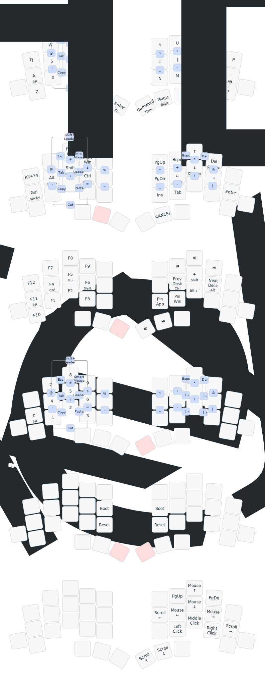

# TOTEM — ZMK Config

Wired split keyboard firmware for the [TOTEM](https://github.com/GEIGEIGEIST/TOTEM) (38 keys) using Seeeduino XIAO RP2040 MCUs connected via TRRS cable.

Based on [urob's zmk-config](https://github.com/urob/zmk-config) with full feature set: home row mods, combos, leader keys, mouse emulation, smart behaviors — adapted for QWERTY with ACGS home row mod order.

## Keymap



## Layers

| Layer | Access | Description |
|-------|--------|-------------|
| Base  | default | QWERTY with ACGS home row mods (Alt, Ctrl, Gui, Shift) |
| Nav   | hold Space | Navigation, arrows with long-tap line/doc jumps, sticky mods |
| Fn    | hold Enter | F-keys with ACGS HRMs, media controls, desktop switching |
| Num   | tap right thumb | Number pad via smart num-word, ACGS HRMs |
| Sys   | Fn + Num | Bootloader, reset |
| Mouse | combo E+R | Mouse emulation via smart-mouse tri-state |

## Key Behaviors

- **Home row mods** — balanced hold-taps with `require-prior-idle-ms=150` to prevent misfires during fast typing
- **Magic shift** — tap: repeat after alpha, else sticky-shift; shift+tap: caps-word; hold: shift
- **Smart num** — tap: num-word (auto-deactivates after non-number); double-tap: sticky num layer; hold: num layer
- **Smart mouse** — tri-state toggle, auto-deactivates when pressing keys outside the mouse cluster
- **Sentence mode** — shift+space types `. ` followed by sticky shift
- **Comma/dot morphs** — shift for `;`/`:`, ctrl+shift for `<`/`>`
- **Nav cluster** — arrow keys with long-tap for Home/End/start-of-doc/end-of-doc
- **Copy/cut** — tap: copy, double-tap: cut
- **Swapper** — alt-tab window switcher via tri-state
- **Chordal bootloader** — hold the top five keys on either half for 3 seconds to enter bootloader
- **XIAO RGB LED** — per-layer colors with keypress blink and modifier indication

## Combos

See the Combos layer in the keymap diagram above. Horizontal combos (same row) use 30ms timeout, vertical combos (adjacent rows) use 40ms.

## Hardware

- **MCU:** Seeeduino XIAO RP2040 (both halves)
- **Connection:** Wired split via TRRS cable (PIO UART on peripheral, hardware UART on central)
- **Polling mode:** Required because PIO UART only supports polling

## Building

Requires [ZMK](https://zmk.dev) toolchain, Zephyr SDK, and Python venv with west.

```bash
# Build both halves + generate keymap diagram
make

# Build individual halves
make left
make right

# Regenerate keymap diagram only
make draw

# Flash (hold BOOT button on XIAO while plugging USB)
make flash-left
make flash-right

# Clean build artifacts
make clean
```

## Modules

| Module | Purpose |
|--------|---------|
| [zmk-helpers](https://github.com/urob/zmk-helpers) | Macros for hold-taps, mod-morphs, combos, layers |
| [zmk-auto-layer](https://github.com/urob/zmk-auto-layer) | num-word behavior |
| [zmk-adaptive-key](https://github.com/urob/zmk-adaptive-key) | shift-repeat (magic shift) |
| [zmk-leader-key](https://github.com/urob/zmk-leader-key) | Leader key sequences |
| [zmk-tri-state](https://github.com/urob/zmk-tri-state) | Alt-tab swapper, smart mouse |
| [zmk-unicode](https://github.com/urob/zmk-unicode) | Unicode character input |
| [zmk-chordal-hold](https://github.com/smjothen/zmk-chordal-hold) | Per-half held chord trigger for bootloader |
| [zmk-xiao-rp2040-led](https://github.com/smjothen/zmk-xiao-rp2040-led) | XIAO RP2040 onboard RGB LED layer/mod feedback |
